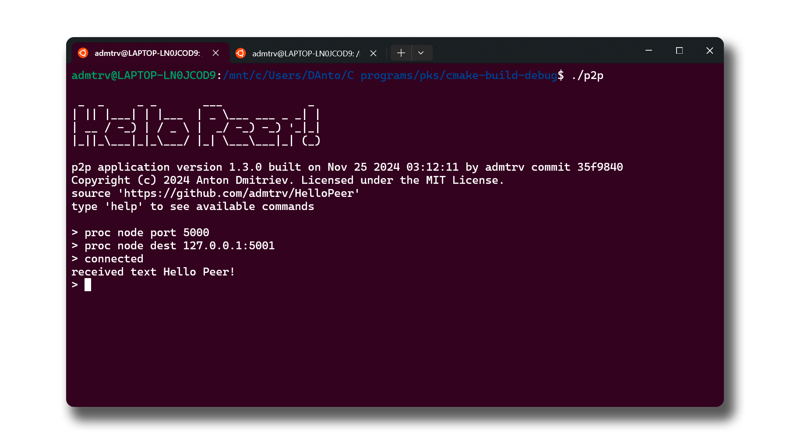

##
This project implements p2p application named `Hello Peer!` that allows message exchange between two nodes on a local Ethernet network. Application uses custom protocol based on UDP (User Datagram Protocol) to transfer data and maintain a connection between two devices both acting as senders and receivers.

## Program Build

The program is written in C++ and uses CMake for building. A `CMakeLists.txt` file is included with all the settings needed to compile the program. If any dependencies are missing, CMake will prompt you.

### Requirements

Before building, make sure you have these installed:

1. **CMake (v3.22+)**
    - Configure and generate build files:
      ```bash
      sudo apt-get install cmake
      ```

2. **C/C++ Compiler**
    - Required for compilation:
      ```bash
      sudo apt-get install gcc
      ```

3. **pthread Library**
    - POSIX thread library (usually part of `build-essential`):
      ```bash
      sudo apt-get install build-essential
      ```

4. **readline Library**
    - For command-line editing and history:
      ```bash
      sudo apt-get install libreadline-dev
      ```

5. **spdlog Library**
    - Fast logging library for C++:
      ```bash
      sudo apt-get install libspdlog-dev
      ```

### Automatic Build

Use an IDE like CLion with built-in CMake support for easy configuration (Recommended).

### Manual Build

To build manually, run these commands:

```bash
mkdir build
cd build
cmake ..
make
```

### Dependencies
CMake will notify you of missing dependencies. To install them:

``` bash
sudo apt-get update
sudo apt-get install <package-name>
```
Replace `<package-name>` with the required dependency.

## Running the Application
After building, start the app in two terminals:

```bash
./p2p
```

After launching, type `help` for available commands.

### Example Usage

Node 1:

``` bash
proc node port 5000
proc node dest 127.0.0.1:5001
```

Node 2:

``` bash
proc node port 5001
proc node dest 127.0.0.1:5000 # i use loopback for testing
``` 

To connect:

```bash
proc node connect
```

To send a message:

```bash
send text Hello Peer!
```

To disconnect:

```bash
proc node disconnect
```

Use `exit` to quit the application.

## Command History
Navigate through command history using the up (`↑`) and down (`↓`) arrows.

## Logging
Logs provide information for debugging and are available at different levels (trace, debug, info, etc.). Set the log level with:

```bash
set log level <level>
```

View logs during runtime with `show log`, or check the `.logs` file after termination.